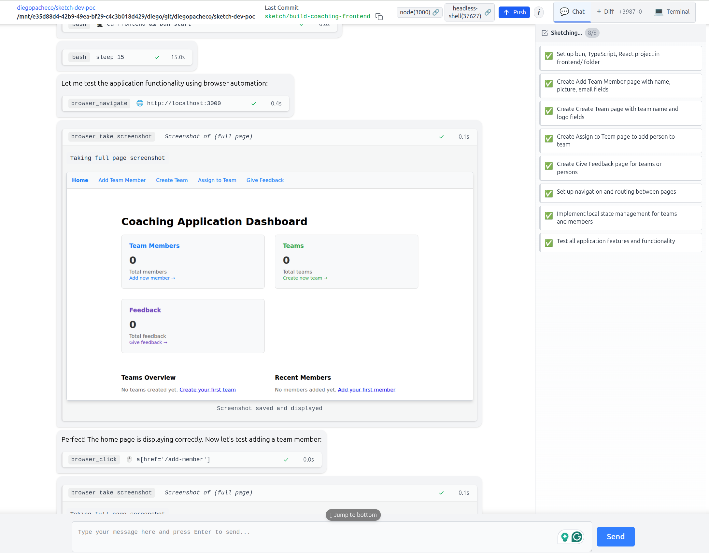

# sketch-dev-poc

sketch-dev: Container Agent for development POC

## Sketch 

## Sketch Dev - POC Experience Analysis / Trade-offs

PROS
 * 25 USD as credit
 * Uses Claude Sonnet 4.0
 * There is a docker conainer. 
 * You can either use the console or the web interface.
 * Web interface allow you to run commands on the container fyle system.

CONS
 - Slow. Claude code is faster.
 - I had to build it, there is not a pre-built image for linux. 
 - Browser tab sometimes closes out of the blue.
 - When I try to push, I had to type my github credentials inside the docker container on the terminal but I could not type.