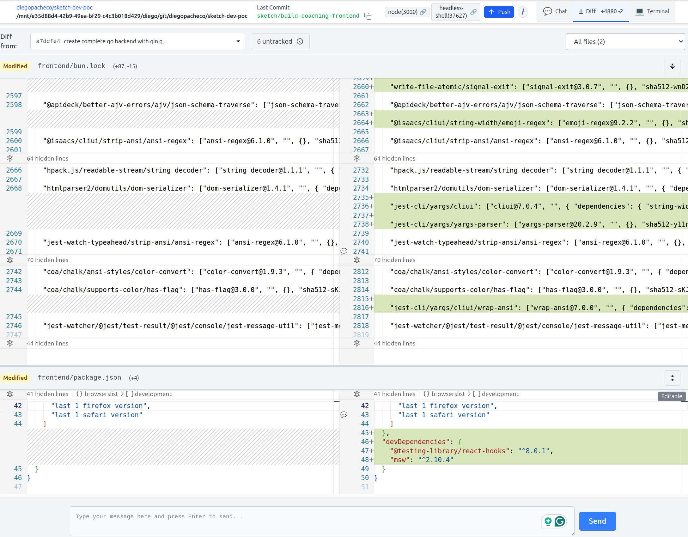
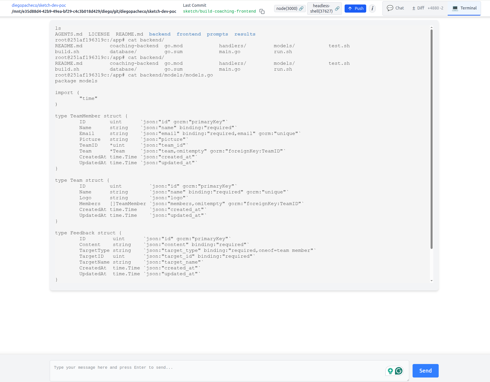

# Coaching Application

A full-stack coaching application built with React, Go, and MySQL, fully containerized with Docker.

## 🚀 Quick Start with Docker

Get the entire application running with a single command:

```bash
# Start the complete stack
./start.sh

# Or rebuild everything from scratch
./start.sh --rebuild
```

## 📱 Application URLs

- **Frontend (React)**: http://localhost:3000
- **Backend API (Go)**: http://localhost:8080  
- **Database (MySQL)**: localhost:3306
- **Health Check**: http://localhost:8080/health

## 🏗️ Architecture

```
🌐 Frontend (React + TypeScript)
       ↓
🔧 Backend API (Go + Gin)
       ↓  
🗄️ Database (MySQL 9)
```

## 📦 Tech Stack

### Frontend
- **React 19** with TypeScript
- **Bun** for package management
- **React Router** for navigation
- **Nginx** for production serving

### Backend  
- **Go 1.24** with Gin framework
- **GORM** for database operations
- **MySQL 9** database
- **RESTful API** architecture

### Infrastructure
- **Docker** & **Docker Compose**
- **Multi-stage builds** for optimization
- **Health checks** for all services
- **Persistent data** storage

## 📋 Features

- ✅ **Team Member Management** - Add, edit, delete team members
- ✅ **Team Creation** - Create and manage teams
- ✅ **Team Assignments** - Assign members to teams
- ✅ **Feedback System** - Give feedback to teams and individuals
- ✅ **Dashboard** - Overview of all data and statistics
- ✅ **REST API** - Complete backend API
- ✅ **Database Persistence** - MySQL with data volumes

## 🐳 Docker Setup

### Prerequisites

- Docker Engine 20.10+
- Docker Compose 2.0+
- 4GB+ available RAM
- Ports 3000, 8080, 3306 available

### Services

| Service | Container | Port | Description |
|---------|-----------|------|-------------|
| Frontend | coaching-frontend | 3000 | React application with Nginx |
| Backend | coaching-backend | 8080 | Go API server |
| Database | coaching-mysql | 3306 | MySQL 9 with persistent data |

### Data Persistence

MySQL data is persisted in `db/mysql_data/` directory, which is automatically created and excluded from git.

### Environment Variables

```bash
# Database
MYSQL_ROOT_PASSWORD=rootpassword
MYSQL_DATABASE=coaching_db
MYSQL_USER=coaching_user
MYSQL_PASSWORD=coaching_password

# Backend
DATABASE_URL=coaching_user:coaching_password@tcp(mysql:3306)/coaching_db
PORT=8080
GIN_MODE=release
```

## 🛠️ Development

### Manual Docker Commands

```bash
# Build and start all services
docker-compose up -d --build

# View logs
docker-compose logs -f

# Stop all services
docker-compose down

# Restart a specific service
docker-compose restart backend

# Execute commands in containers
docker-compose exec mysql mysql -u root -prootpassword
docker-compose exec backend ./coaching-backend --help
```

### Individual Development

If you want to run services individually:

#### Frontend
```bash
cd frontend
bun install
bun start
# Available at http://localhost:3000
```

#### Backend
```bash
cd backend
./build.sh
./run.sh
# Available at http://localhost:8080
```

### Testing

```bash
# Frontend tests
cd frontend && npm test

# Backend tests  
cd backend && go test ./...
```

## 🗄️ Database

### Schema

The database schema is automatically created when MySQL starts:

- **teams** - Team information (id, name, logo)
- **team_members** - Member information (id, name, email, picture, team_id)
- **feedback** - Feedback entries (id, content, target_type, target_id)

### Sample Data

The database includes sample data for development:
- 3 teams (Development, Design, Marketing)
- 4 team members with assignments
- 4 feedback entries

### Database Access

```bash
# Connect to MySQL
docker-compose exec mysql mysql -u root -prootpassword coaching_db

# View tables
SHOW TABLES;

# View sample data
SELECT * FROM teams;
SELECT * FROM team_members;
SELECT * FROM feedback;
```

## 🔄 API Endpoints

### Team Members
- `GET /api/members` - List all members
- `POST /api/members` - Create member
- `GET /api/members/:id` - Get member
- `PUT /api/members/:id` - Update member
- `DELETE /api/members/:id` - Delete member

### Teams
- `GET /api/teams` - List all teams
- `POST /api/teams` - Create team
- `GET /api/teams/:id` - Get team
- `PUT /api/teams/:id` - Update team
- `DELETE /api/teams/:id` - Delete team

### Assignments
- `POST /api/assignments` - Assign member to team
- `GET /api/assignments` - List assignments
- `GET /api/assignments/unassigned` - Unassigned members
- `DELETE /api/assignments/member/:id` - Remove from team

### Feedback
- `GET /api/feedback` - List feedback
- `POST /api/feedback` - Create feedback
- `GET /api/feedback/:id` - Get feedback
- `PUT /api/feedback/:id` - Update feedback
- `DELETE /api/feedback/:id` - Delete feedback

## 🛠️ Troubleshooting

### Common Issues

**Port conflicts:**
```bash
# Check what's using the ports
sudo lsof -i :3000
sudo lsof -i :8080
sudo lsof -i :3306
```

**Database connection issues:**
```bash
# Check MySQL logs
docker-compose logs mysql

# Verify database is ready
docker-compose exec mysql mysqladmin ping -h localhost -u root -prootpassword
```

**Frontend not loading:**
```bash
# Check frontend logs
docker-compose logs frontend

# Rebuild frontend
docker-compose build --no-cache frontend
```

**Backend API errors:**
```bash
# Check backend logs
docker-compose logs backend

# Test health endpoint
curl http://localhost:8080/health
```

### Clean Reset

```bash
# Stop and remove everything
docker-compose down -v --remove-orphans

# Remove images
docker-compose down --rmi all

# Remove data (WARNING: This deletes all data)
rm -rf db/mysql_data/

# Start fresh
./start.sh --rebuild
```

## 📋 Project Structure

```
├── frontend/           # React TypeScript application
│   ├── src/             # Source code
│   ├── Dockerfile       # Frontend container
│   └── nginx.conf       # Nginx configuration
├── backend/            # Go API application  
│   ├── handlers/        # API handlers
│   ├── models/          # Database models
│   ├── database/        # Database connection
│   └── Dockerfile       # Backend container
├── db/                 # Database files
│   ├── schema.sql       # Database schema
│   └── mysql_data/      # Persistent data (git ignored)
├── docker-compose.yml  # Docker orchestration
├── start.sh            # Startup script
└── README.md           # This file
```

## 🎆 Contributing

1. Fork the repository
2. Create a feature branch
3. Make your changes
4. Test with `./start.sh`
5. Submit a pull request

## 📋 License

This project is licensed under the MIT License.

---

🚀 **Happy Coaching!** - Built with ❤️ using React, Go, and MySQL

sketch-dev: Container Agent for development POC

## Sketch 

Sketch web prompt interface <br/>

<br/>

Sketch Git DIFF UI <br/>

<br/>

Sketch Terminal Interface <br/>

<br/>

## Sketch Dev - POC Experience Analysis / Trade-offs

PROS
 * 25 USD as credit
 * Uses Claude Sonnet 4.0
 * There is a docker container. 
 * You can either use the console or the web interface.
 * Web interface allow you to run commands on the container fyle system.
 * It works, I was able to give it tasks and get code done.

CONS
 - Slow. Slower then all agents I tested. Claude code is faster than this. Opencode still the fastest.
 - I had to build it, there is not a pre-built image for linux. 
 - Browser tab sometimes closes out of the blue.
 - When I try to push, I had to type my github credentials inside the docker container on the terminal but I could not type.
 - I had to paste the username for github. I was able to "login with github" it sucks they dont have the integration on the UI for credentials.
 - When I paste the user I got this:
 ```
 https://sketch.dev/s/fb6d-7qgd-2wtn-518s ($1.25/10.00)> Username for 'https://github.com': diegopacheco
🦸 diegopacheco
🕴️  I see you've mentioned "diegopacheco" - could you clarify what you'd like me to do with this? Are you:

- Looking to add this as a team member in the coaching application?
- Need me to reference this GitHub username for something?
- Want me to configure git settings?
- Something else entirely?

Let me know how I can help!
```
 - I had to create a token and paste on the web terminal (ugh so bad)
 - 

### Related POCs

* OpenAI Codex POC https://github.com/diegopacheco/codex-poc
* Google Jules https://github.com/diegopacheco/google-jules-poc
* Claude Code POC https://github.com/diegopacheco/claude-code-poc
* Cursor POC https://github.com/diegopacheco/docker-cleanup
* Gemini-cli POC: https://github.com/diegopacheco/gemini-cli-poc 